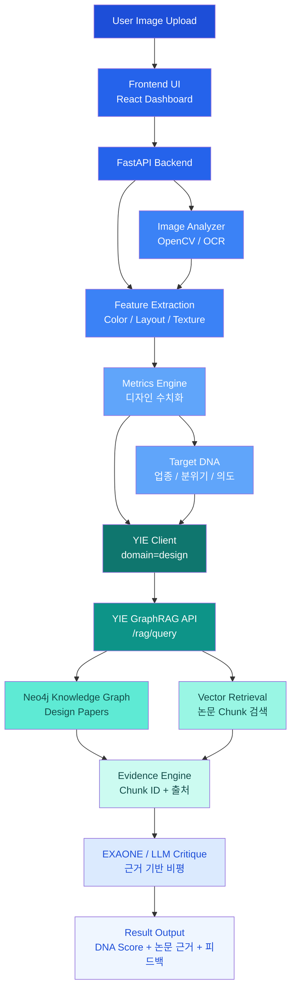

# 🌙 Mood-DNA Ver 3.0


> **Design Intelligence for Designers**  
> 감각을 데이터로, 아이디어를 구조로. — **YIE 통합 버전**


---

> ⚠️ **v3는 개발 진행 중입니다.**  
> 안정 버전은 [Mood-DNA v2](https://github.com/hoilycat/mood-dna-v2)를 참고하세요.

---

## 🖋️ Introduction

Mood-DNA는 디자이너를 위한 **AI 디자인 파트너**입니다. 단순한 이미지 분석을 넘어, 시각적 지표(Metrics)와 디자인 이론(Knowledge Graph)을 결합하여 디자인 의사결정을 빠르고 정교하게 만들어주는 하이브리드 지능형 도구입니다.

디자인은 감각의 영역이지만, Mood-DNA는 그 감각을 **수치화된 데이터와 학술적 근거**로 번역하여 디자이너의 설득력을 극대화합니다.

---

## 🎯 Core Features

### 🔍 1. Multi-Dimensional DNA Scanning
OpenCV와 EasyOCR을 활용하여 이미지의 유전자를 정밀 해독합니다.
- **Visual Metrics:** 밝기, 복잡도, 시각적 집중도(Saliency), 대칭성, 여백 비율, 대비, 구도 안정성 분석.
- **Form & Texture:** 곡률(Roundness), 직선성(Straightness), 매끄러움(Smoothness) 분석을 통한 형태적 특징 추출.
- **Color DNA:** K-Means 알고리즘 기반 주요 컬러 팔레트 및 색채 조화도 산출.

### 🧠 2. YIE GraphRAG Critique ✨ v3 핵심
단순 분석을 넘어 **1,374개 디자인 학술 논문**에 기반한 근거 중심 비평입니다.
- **Knowledge Graph:** Neo4j 기반 111개 논문, 7개 허브 태그, SIMILAR_TO 의미 네트워크 구축.
- **Domain-Aware RAG:** YIE `/rag/query domain=design`을 통해 디자인 도메인 언어만 사용한 비평 생성.
- **Evidence-based Advice:** 추측이 아닌 논문 Chunk ID와 출처가 명시된 근거 기반 조언.

```
Mood-DNA v3 ──(HTTP)──▶ YIE /rag/query (domain=design)
                               │
                          Neo4j GraphRAG
                          디자인 도메인 1,043개 청크
                          (브랜드·시각·주의·선호·처리유창성 논문)
```

### 🏆 3. Design Audition (Batch Analysis)
여러 개의 시안 중 브랜드 목표 DNA에 가장 부합하는 'Winner'를 선정합니다.
- **DNA Matching:** 설정한 Target DNA와 실제 데이터 사이의 유사도를 계산하여 순위 산정.
- **Master's Report:** AI가 오디션 심사위원처럼 각 시안의 장단점을 비교 분석하여 마스터 리포트를 생성합니다.

### 🖼️ 4. Style Benchmarking
AI 피드백과 연동된 실무 레퍼런스 제안.
- **SerpApi Integration:** 분석 결과와 매칭되는 최적의 디자인 레퍼런스를 Pinterest, Dribbble, Behance 등에서 실시간으로 큐레이션합니다.

---

## ⚙️ System Architecture



---

## 🧩 Tech Stack

### Frontend
- **Framework:** React (Vite), TypeScript
- **Styling:** Tailwind CSS, Shadcn UI
- **Data Viz:** Recharts (Radar Chart 기반 DNA 시각화)

### Backend
- **Framework:** Python (FastAPI)
- **Analysis:** OpenCV, NumPy, EasyOCR, Rembg
- **Database:** SQLAlchemy (SQLite)
- **AI Engine:** **YIE (Universal Insight Engine)** — Neo4j GraphRAG + EXAONE 3.5

### AI Models
- **Main Engine:** Google Gemini 1.5 Pro / Flash
- **GraphRAG:** EXAONE 3.5 (via Ollama, YIE 내부)
- **Backup/Local:** Groq (Llama 3.3)

---

## 📁 Project Structure

```bash
Mood-DNA-V3/
├── frontend/             # React + Vite 기반의 시각 분석 UI
│   └── src/              # DNA 대시보드 및 위저드 컴포넌트
├── backend/              # FastAPI 기반 고성능 분석 엔진
│   └── app/
│       ├── services/     # 핵심 로직 (Analyzer, YIE 연동 클라이언트)
│       └── models.py     # 디자인 히스토리 DB 스키마
└── README.md
```

---

## 🧭 Roadmap

- [x] 이미지 수치 분석 엔진 구축 (OpenCV)
- [x] 실시간 디자인 DNA 시각화 (Radar Chart)
- [x] YIE GraphRAG 엔진 구축 (Neo4j, 1,374 chunks)
- [ ] Mood-DNA → YIE `/rag/query` HTTP 연동 👈 Current
- [ ] 분석 결과 화면에 논문 근거 카드 표시
- [ ] UI 리디자인 (v3 전용)
- [ ] Target Insight 기반 업종별 특화 조언 모듈 고도화
- [ ] 디자인 히스토리 스마트 아카이빙 기능

---

## ✨ Philosophy

"디자인의 '감성'을 손상시키지 않으면서 AI의 '이성'을 더하다."  
Mood-DNA는 기술이 디자인을 대체하는 것이 아니라, 디자이너가 자신의 직관을 논리적으로 증명하고 더 높은 차원의 창의성에 집중할 수 있도록 돕는 도구입니다.

---

## 🌌 Credits

Designed & Developed by 용용  
감각적 사고 + 논리적 구조를 사랑하는 디자이너/메이커.
